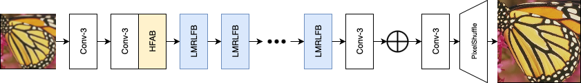
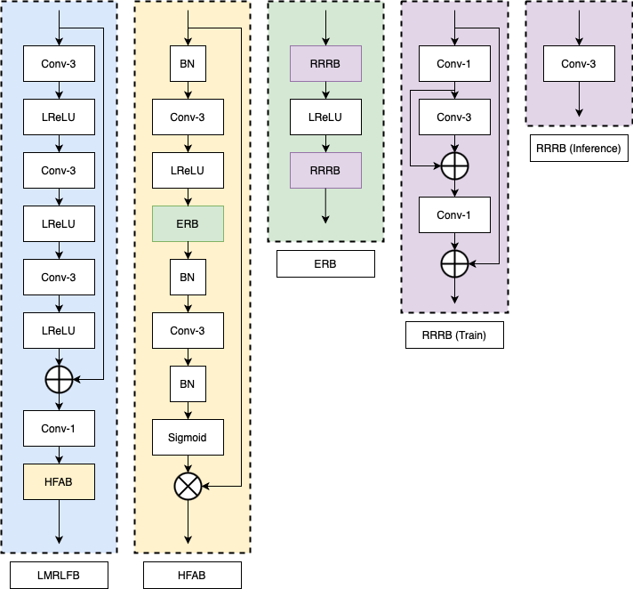
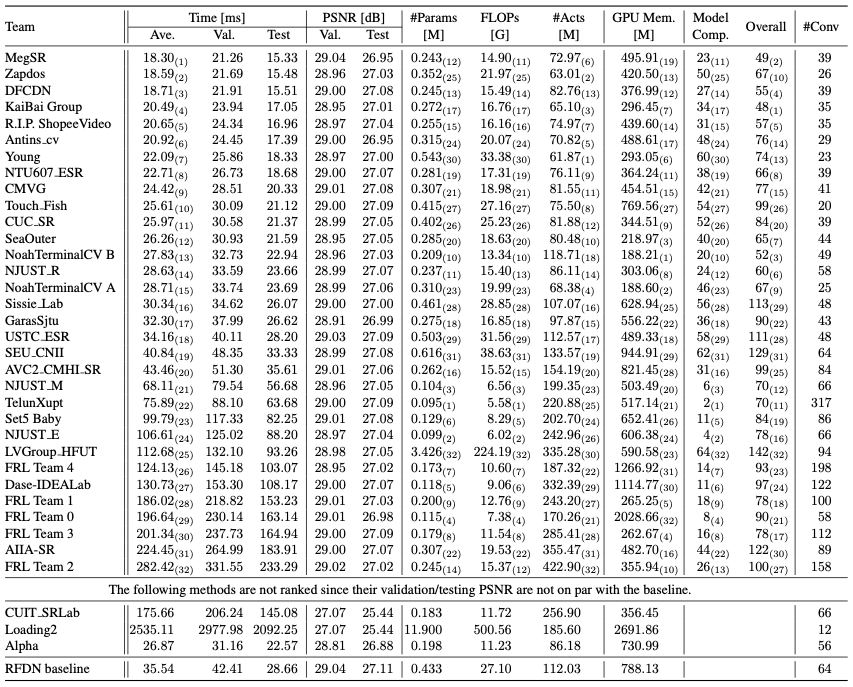

# [NTIRE 2023 Challenge on Efficient Super-Resolution](https://cvlai.net/ntire/2023/) @ [CVPR 2023](https://cvpr2023.thecvf.com/)


## Low Memory Residual Local Feature Distillation Network (LMRLFN)

### LMRLFN



### LMRLFB


## How to test LMRLFN model?
```bash
python test_demo.py --model_id 33
```   

## Results

- Placed third in the task of memory consumption
- Placed seventh when considering the overall performance


## License and Acknowledgement
This code repository is release under [MIT License](LICENSE). 
